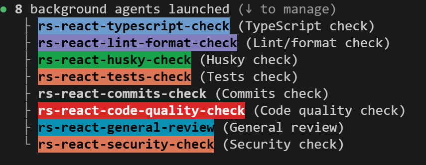
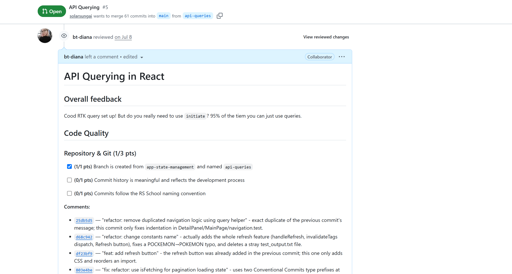
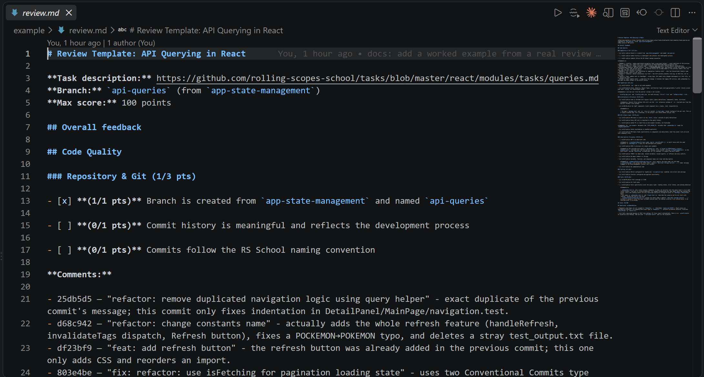

# RS School React — PR Review Toolkit

setup that drafts code-quality reviews for
[RS School](https://rs.school/) React course pull requests.

A [Claude Code](https://claude.com/claude-code) toolkit built to review student PRs the way I did as a mentor. Seven subagents each check one thing — commits, TypeScript, code quality, tests, and more — and the results are combined into a posted review and a scored document.

See [`example/`](example/) for a real review it produced, with every artifact from the run.

## How it works

```
                     rs-school-react-pr-review  (skill, runs in the main loop)
                                    │
        ┌───────────┬───────────┬───┴───────┬───────────┬───────────┬───────────┐
   typescript  lint-format    tests     commits   code-quality  security    general
      check       check       check      check       check       check      review
        │           │           │          │           │           │           │
        └───────────┴───────────┴────┬─────┴───────────┴───────────┴───────────┘
                                     │  each writes <agent>.json
                                     ▼
                    .claude/reviews/<student>-<task>.comments/
                                     │
                    ┌────────────────┴────────────────┐
                    ▼                                 ▼
   rs-school-react-post-pending-review        rs-react-review-writer
   merges every JSON → one PENDING            maps findings to the rubric,
   review on the PR, in one request           scores, writes review.md
```

The seven check agents run **concurrently** and never talk to GitHub. Each one writes its
findings to its own JSON file, anchored to a line where it can be, and returns the rest as
text. (The commits agent is the one exception — a commit message is not a line in the diff,
so it only returns text.) Posting happens once, from one place. Scoring happens once too, in
one place.



This screenshot is from before the Husky check was retired, so it shows eight agents
instead of seven. The mechanism is the same today, just with one fewer agent.

## What's in here

```
.claude/
├── skills/
│   ├── rs-school-react-pr-review/          orchestrator — the entry point
│   ├── rs-school-react-post-pending-review/ merges comment JSON → one pending review
│   └── rs-school-react-review-template/     task description → review template
├── agents/
│   ├── rs-react-typescript-check.md         any, enums, generics, strict mode
│   ├── rs-react-lint-format-check.md        npm run lint, Prettier, disabled rules
│   ├── rs-react-tests-check.md              suite run, coverage, test quality
│   ├── rs-react-commits-check.md            Conventional Commits + message vs. diff
│   ├── rs-react-code-quality-check.md       architecture, hooks, naming, DRY/KISS/YAGNI
│   ├── rs-react-security-check.md           XSS sinks, unsafe URLs, secret leakage
│   ├── rs-react-general-review.md           correctness, a11y, npm audit
│   └── rs-react-review-writer.md            the only place scoring happens
├── templates/                               empty — generated per task, see below
└── settings.json                            permissions (mentee clones are read-only)

example/                                     a real review, with every artifact from the run
```

## How it got built

None of this was planned up front. Every piece exists because the version before it broke,
in a specific way.

**1. Templates first, still reviewing by hand.** I started by writing a rubric template for
each task, so I was at least checking the same things for every student and scoring them
the same way. It made the reviews more consistent, but it saved almost no time — reading
the code was always the slow part. Still, it left me with a written, precise list of what I
check. That is exactly the kind of thing you can hand to an agent.

**2. Feeding the template to an agent didn't work at first.** The first version took a
template and a PR and produced reviews that missed problems I could see in
the code. It had the checklist but not the judgement. So I reviewed a few PRs by hand
and gave the agent my own reviews to study — not "here are the rules" but "here is what I
actually commented on, work out what I pay attention to". Those findings are what the check
agents encode today: a component doing five things costs a lot of points, a stray magic
number costs one, and a name is only worth flagging when it actually misleads.

**3. One agent doing everything was too slow.** Commit messages, TypeScript, code quality,
tests, tooling, task requirements — one agent, in order, over a PR touching sixty files. It
took long enough that I stopped wanting to run it. Splitting it into smaller agents that run
in parallel fixed the speed. It also brought a second benefit I did not expect: a small
agent with one job is much easier to correct. When it gets something wrong, I know exactly
which file to fix.

**4. A subagent cannot spawn subagents.** The plan was a main agent that dispatches the
checks, collects their output, and writes `review.md`. Claude Code does not allow that —
delegation only goes one level deep, so an agent cannot launch other agents. Turning the
coordinator into a **skill** solved it, because a skill runs in the main loop, where the
Agent tool works. From there it can dispatch all seven checks at once.

**5. Comments in a markdown file are not where comments belong.** For a while the agents
wrote every finding into `review.md` as a list of `file:line` references, and I copied each
one onto the PR by hand — the tedious part of reviewing, still fully manual. So I moved
posting to `gh`. That surfaced the next problem: several agents each posting their own
comments meant several separate review threads on one PR, and they could not reliably
append to a review that already existed. The fix is the shape the pipeline has now — every
agent writes its comments to a JSON file, and one posting step merges them into a single
request. That is where `rs-school-react-post-pending-review` came from.

**6. Scoring moved into its own agent.** Writing `review.md` was still the coordinator's
job, tangled up with dispatching everything else. Pulling it out into
`rs-react-review-writer` made scoring one agent's job, and made scores comparable across
students because they all come from the same place.

**7. Then: run it, correct it, run it again.** Every review surfaced something — a false
positive, a nit not worth flagging, a formatting habit of mine it kept getting wrong. Each
one became a rule: don't score missing return types, flag props drilling only when more
than one component just forwards, treat a repo-wide formatting failure as one finding, not
one per file. After enough rounds it got genuinely good, and it carried me through the
reviews left at the end of the course.

## If you want to do this for your own work

Write down what you actually do first, in a
form precise enough to check against. Then automate one piece at a time, and let each
failure tell you what the next piece should be. The pipeline here looks deliberate, but it
is really seven separate problems, each fixed in the smallest way that worked.

This whole repo is really just one example of how a review process can be sped up, not a
fixed recipe. The seven checks here are the ones that mattered for a React course rubric —
TypeScript, lint, tests, commits, architecture, security, everything else. Your own review
work probably cares about different things. Nothing stops you from writing your own
subagents for whatever you actually check, and wiring them into a skill the same way.

## Requirements

- Claude Code
- [`gh`](https://cli.github.com/) authenticated as the account that will own the review
  (`gh auth login`) — the pending review is created through it
- Node.js, to install and run each student project

## Using it

First, connect `gh` to the account that will own the review: `gh auth login`, then check
it worked with `gh auth status`. Every post to a PR goes through this account.

No rubrics ship with this repo — `.claude/templates/` starts empty. Generate one per task,
or copy [`example/template.md`](example/template.md) as a starting point.

### Generate a rubric for a new task

```
Make a review template for
https://github.com/rolling-scopes-school/tasks/blob/master/react/modules/tasks/forms.md
```

The `rs-school-react-review-template` skill reads the task description and keeps only the
requirements about **how the code is written** — which library, which pattern, what must
be typed and tested. It drops the functional ones ("shows 20 cards per page") and writes
`.claude/templates/<task>.md` with the points summing to 100.

### Review a PR

Open Claude Code in this folder and give it the PR and the matching template:

```
Review https://github.com/<owner>/<repo>/pull/42
Template: .claude/templates/<task-name>.md
Local clone: <path to a clone of the student's repo>
```

The skill tries to infer the template from the PR's branch name or title, but naming it
directly is safer. It's required whenever the branch name doesn't match a template already
in `.claude/templates/`, including one just generated with the skill above.

A local clone is optional — without one the skill clones the PR branch itself. Everything
else runs on its own: install dependencies, dispatch the seven checks, post one pending
review, write `.claude/reviews/<student>-<task>.md`.

The pending review then shows up under **Review in progress** in the VS Code GitHub Pull
Requests extension, where each comment can be edited or deleted before submitting.



## What a run produces

A run leaves two things behind:

- a pending review on the PR, with every finding posted as an inline comment, ready to
  edit and submit
- a scored `review.md` file, written locally, that turns those same findings into a
  rubric score



[`example/`](example/) holds a complete review of one student's PR for the API Querying task:
the rubric it was scored against, the raw JSON each agent
wrote, the 11 inline comments actually posted to the PR, and the finished `review.md` at
93/100. Its README walks through the run — which agent found what, why four findings were
commented on but not scored, and which of the thirteen drafted comments I rewrote, dropped,
or added by hand before submitting.

## Design notes

**Pending reviews only.** The workflow never submits, approves, or requests changes. It
only ever creates a draft, so nothing reaches the student that I haven't read myself.

**Praise gets a line too.** Agents post short `👍` notes on code that is done well, and the
review-writer skips them when scoring. A review made only of complaints is a bad review.
"Good use of RTK Query here", on the actual line, lands better than one warm sentence at
the top.

**Comment lines are checked against the three-dot diff.** GitHub anchors review comments
against the merge-base diff, not `base..HEAD`. One comment on a line outside that diff comes
back as a `422` and drops **the entire review**, not just the bad comment. So the posting
skill rebuilds the addressable line set from `git merge-base` first, and moves anything it
can't anchor into `unposted.json` instead of risking the whole batch.

**Whole-file findings get converted.** GitHub's draft-review API has no file-level comment
type, so a `subject_type: "file"` finding is re-anchored to that file's first changed line
before posting.

**Scoring lives in exactly one agent.** The check agents report problems; they don't know
the rubric and they don't assign points. Only `rs-react-review-writer` reads the template,
maps findings to criteria, and applies deductions. That's what keeps two students' scores
comparable.

**Issues carried over from a previous task are not scored twice.** Each task builds on the
last branch, so a problem flagged last week can still sit in this week's diff. The
review-writer fetches the reviews already left on the student's earlier PRs and skips the
deduction for anything already flagged there. The comment still gets posted — only the
points aren't taken again.

**Templates are the source of truth, not the task page.** A criterion that isn't in the
template isn't evaluated. This keeps reviews consistent across students, and keeps the
scope on code quality rather than feature completeness.

## Notes

- `.claude/reviews/` is gitignored. It holds real student reviews, so it stays local.
- The review workflow expects `.claude/reviews/pr-links.md` — a small registry mapping each
  student to their PR per task. It's created on first use and is also gitignored.
- Paths in the skills are relative to the project root, so the toolkit works from any
  folder. Student repos are expected as sibling clones next to it.
- `settings.json` denies every write-side `git -C` command, so the agents can read a
  student clone but never commit to it.
