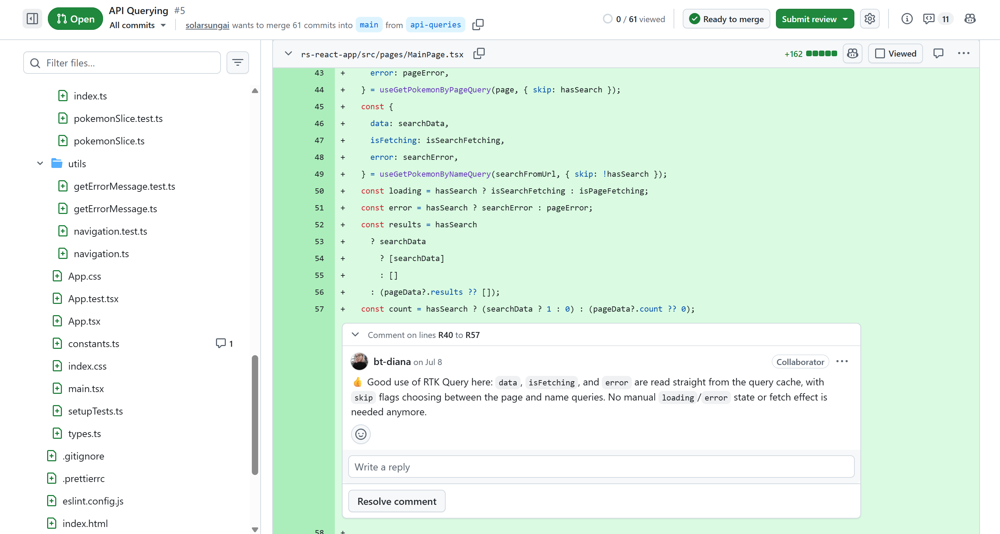
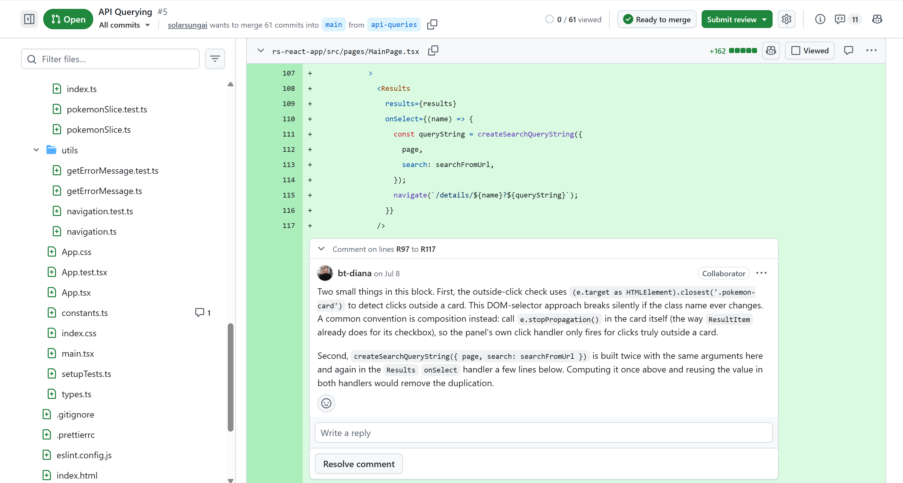

# Example: one real review, start to finish

This folder holds the artifacts from an actual review the pipeline produced.

**Task:** *API Querying* — RTK Query, explicit cache invalidation, cache TTL from an
environment variable
**PR:** [solarsungai/class-components#5](https://github.com/solarsungai/class-components/pull/5) —
the student agreed to make it public
**Score:** 93/100

Everything here — every finding, every comment body, the scoring — is exactly what the run
produced.

## Files in this folder

| File | What it is |
|---|---|
| `template.md` | The rubric the PR was scored against — a copy of `.claude/templates/api-queries.md` as it was at the time |
| `comments/*.json` | What each check agent wrote. One file per agent, this is the raw pipeline output |
| `review.md` | The scored review document the review-writer produced |

## How this run went

**1. Task identified from the branch.** The PR branch is `api-queries`, so the workflow
loaded `.claude/templates/api-queries.md`. The template decides what gets checked and what
each criterion is worth. Nothing outside it gets evaluated.

**2. Previous PRs collected.** `pr-links.md` lists this student's earlier task PRs (#3
hooks-and-routing, #4 state-management). The review-writer reads the reviews already left
there, so a problem carried over from an earlier task isn't charged twice.

**3. Seven agents ran in parallel.** Each wrote its line-anchored findings to its own JSON
file in `comments/`:

| Agent | Inline comments | Also returned as text |
|---|---|---|
| `code-quality` | 7 (4 issues + 3 positive notes) | project root is a nested folder, not the git root |
| `general` | 3 | — |
| `tests` | 3 | coverage and suite run summary |
| `commits` | 0 — writes no JSON | 7 commit-message problems |
| `typescript` | 0 | `strict` / `noImplicitAny` missing in both tsconfigs |
| `lint-format` | 0 | lint fails repo-wide on CRLF line endings |
| `security` | 0 | — |

A commit message is not a line in the diff, so the commits agent has nothing to anchor to
and just returns text. An empty JSON file means the agent found nothing worth a comment —
`typescript.json`, `lint-format.json`, and `security.json` are all empty here.

`comments/husky.json` is a leftover from a check that has since been retired. Husky setup
is no longer part of any rubric.

**4. One pending review posted.** The posting skill merged all 13 comments into a single
request. Three of them were whole-file findings (`constants.ts`,
`useSearchTermLocalStorage.tsx`, `pokemonApi.test.ts`). GitHub's draft-review API has no
file-level comment type, so each one was re-anchored to that file's first changed line
before posting.

**5. The review document was written.** The review-writer mapped each finding to a rubric
criterion, applied the deductions, and wrote `review.md`.

## Positive comments are part of the output

Three of the seven code-quality comments start with 👍 — good use of RTK Query, explicit
tag invalidation on the refresh button, named constants replacing scattered magic strings.
They get posted inline like any other comment, and the review-writer just skips them when
scoring. A review that only lists problems is discouraging to read, and praise on the
actual line is worth more than one warm sentence at the top.

## The draft is a draft

The pipeline produced 13 comments; 11 were submitted. The differences:

- The two comments on `Flyout.tsx` (one about `initiate()` never unsubscribing, one about
  `.unwrap()` rejecting with a non-`Error` object) got replaced by a single question in my
  own voice — *"Do you really need to use `initiate` here?"* — which teaches better than
  two paragraphs of diagnosis.
- The accessibility note on the loading overlay didn't make it into the submitted review.
- A comment about props not being wrapped in `Readonly<...>` was added by hand.

This is the point of a pending review. The agents are good at finding things and reliably
bad at deciding what a particular student needs to hear this week.

## Where the 7 points went

| Criterion | Score | Why |
|---|---|---|
| Commit history is meaningful | 0/1 | 7 commits whose message does not match the diff |
| Commits follow the convention | 0/1 | `fix: refactor:` uses two type prefixes; `feat:` on a whitespace-only test change |
| Cache TTL from an environment variable | 3/4 | No `.env.example` documents `VITE_CACHE_TTL` |
| DRY | 5/6 | `createSearchQueryString` built twice with the same arguments |
| Tests cover the query layer | 5/8 | No test for the error path or caching behaviour; test names inconsistent |

Four findings were flagged but **not** scored, because reviews of the student's earlier
tasks had already charged for them: missing `strict` mode, `.tsx` files with no JSX, the
`closest('.pokemon-card')` outside-click check, and a `describe('storage service')` block
naming the wrong unit. Each one still gets a comment, because a student should hear that a
problem is still there. The points just come off once, in the task where it first showed up.
